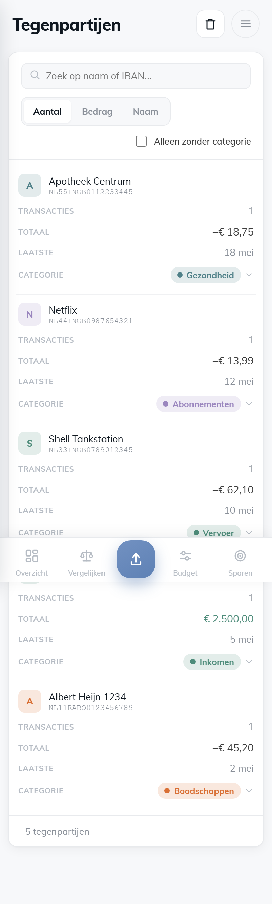
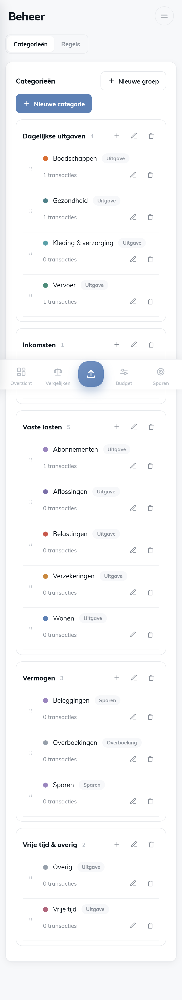

# Design-brief — Tegenpartijen & Beheer (mobiel)

Voor **Claude Design**: ontwerp een mobiele look & feel voor de twee schermen die
**niet** in het oorspronkelijke mobiele ontwerp zaten — **Tegenpartijen** en
**Beheer** (Categorieën + Regels) — in dezelfde stijl als de rest. Hieronder de
bestaande ontwerptaal, per scherm de huidige opbouw/data/acties, en de technische
kaders zodat het ontwerp 1-op-1 implementeerbaar is.

---

## 1. Bestaande mobiele ontwerptaal (volg deze)

Al toegepast op **Overzicht, Transacties, Budgetten, Spaardoelen** (+ Importeren via
de FAB). Bron-mock: `packages/design/bokkiep.zip` → `mobile/chrome.jsx` (palette +
`Screen/Phone/BottomNav/StatusBar`, `A_card`, `A_Top`) en de varianten
`mobile/variantA.jsx` ("Helder", light) en `mobile/variantC.jsx` ("Donker", dark).
**Voeg de nieuwe schermen toe als `A_Tegenpartijen`/`C_Tegenpartijen` en
`A_Beheer`/`C_Beheer` in diezelfde mock**, hergebruik `PAL`, `CATM`, `Screen`,
`BottomNav`, `A_Top`/`A_card`.

**Shell**
- Geen topbalk. Per-scherm **header**: kleine subtitel + grote titel (25px, 800)
  links, ronde **avatar** rechtsboven (opent de drawer met de overige views).
- **Bottom-tab bar**: Overzicht · Vergelijken · [import-FAB] · Budget · Sparen.
  Tegenpartijen en Beheer zitten **niet** in de tabs → ze openen via de drawer.
  Ontwerp dus voor "scherm geopend vanuit de drawer", met de bottom-bar eronder.
- Breakpoint: mobiel = viewport **≤ 860px** (geen device-sniffing).

**Kaarten & vorm**
- Kaarten: `var(--surface)` achtergrond, **afgeronde hoeken** (hero/tegels ~22px,
  lijst-kaarten ~20px), zachte rand `var(--line-soft)`, subtiele schaduw.
- Lijsten = rijen ín één kaart, gescheiden door dunne dividers (`var(--line-soft)`),
  geen losse omkaderde boxes per rij.

**Patronen die al bestaan (hergebruik waar logisch)**
- **Filter-chips**, horizontaal scrollend (Transacties: Alle / Niet ingedeeld + badge / categorie-chips).
- **Veeg-om-actie** (`SwipeRow`): rij naar links vegen onthult één actie (Transacties: "Indelen").
- **Bottom-sheet** (`sheet-overlay`/`sheet`): categorie kiezen, bedrag/doel bewerken
  (`CategorySheet`, `BudgetSheet`, `GoalSheet`) — grip-balkje, titel + X, lijst/inputs, primaire knop.
- **Voortgangsbalk** (`.bar`) en ring/donut/mini-bars charts.
- **Niet-ingedeeld = oranje tint** (`var(--orange-tint)`) als nudge.
- Header-**subtitel** draagt context (bv. "86 transacties", "3 categorieën", periode-label).

**Kleur-tokens** (alles thema-adaptief; light → dark wisselt automatisch mee)

| token | light | dark |
|---|---|---|
| `--ink` (koppen) | `#101820` | `#F1F4F8` |
| `--body` | `#3C3C3C` | `#C3CAD4` |
| `--muted` | `#8A9099` | `#7E8896` |
| `--faint` | `#B6BCC4` | `#5C6573` |
| `--line` / `--line-soft` | `#E8EAED` / `#F0F1F3` | `#2A323E` / `#232B36` |
| `--subtle` (pagina) | `#F7F8FA` | `#12161D` |
| `--surface` (kaart) | `#FFFFFF` | `#1B212B` |
| `--blue` / `--blue-soft` | `#5E81B5` / `#EEF3F9` | `#7BA0D8` / `rgba(123,160,216,.16)` |
| `--orange` / `--orange-soft` / `--orange-tint` | `#D96F34` / `#FBEFE6` / `#FDF6F1` | `#E89055` / `rgba(232,144,85,.16)` / `…,.10` |
| `--pos` / `--over` / `--warn` | `#4E8C7A` / `#C7584B` / `#C9883E` | `#5FB199` / `#E0726A` / `#DDA85C` |

Categorie-accenten staan per categorie opgeslagen (eigen hex), met
`catTint(color)` → `color-mix(... 16%, transparent)` voor de zachte tint-achtergrond.

**Iconen** (Lucide-stijl, stroke): o.a. `wallet, list, scale, settings, sliders,
target, upload, search, filter, plus, edit, trash, grip, check, chevronDown,
chevronUp, x`.

---

## 2. Scherm: Tegenpartijen

> Huidige staat (responsive desktop-tabel, **nog niet** herontworpen):
> 
> Desktop ter referentie: `cur_tegenpartijen_desktop_light.png` · dark: `cur_tegenpartijen_mobiel_dark.png`

**Doel.** Per tegenpartij (winkel of rekening) wijs je **één keer** een categorie toe;
álle transacties van die partij — nu én bij toekomstige imports — krijgen die
categorie automatisch. Dit is dé "bulk-categoriseer" plek.

**Data per rij**
- Naam (bv. "Albert Heijn 1234").
- IBAN (monospace) **of** "Pinbetaling — geen IBAN".
- Aantal transacties (`count`).
- Totaalbedrag (`total`, ±, kan inkomsten of uitgaven zijn).
- Laatste datum (`lastDate`).
- Toegewezen categorie (`categoryId`, mag leeg zijn → "niet ingedeeld").

**Acties / besturing**
- Zoeken op naam of IBAN.
- Sorteren: **Aantal · Bedrag · Naam** (nu een segmented control).
- Filter: "alleen zonder categorie".
- Categorie toewijzen via een categorie-kiezer (`CatSelect`, inclusief Inkomen) →
  `assignPayeeCategory({counterIban, merchant}, categoryId)`.
- Bovenaan een **notice** als er niet-ingedeelde tegenpartijen zijn.
- Header-actie "Alles wissen" (verwijdert álle onthouden koppelingen — destructief).

**Suggestie voor mobiel** (ter inspiratie, niet bindend). Dit scherm lijkt sterk op
Transacties → leent zich voor **dezelfde taal**: zoekbalk + chips (Alle / Zonder
categorie / sorteer), een **kaartlijst** met per rij avatar (initiaal in categorie-
tint) + naam + IBAN-subtekst + bedrag/aantal, en **veeg-om-in-te-delen** dat de
categorie-sheet opent. Niet-ingedeelde rijen oranje-getint. Subtitel "N tegenpartijen"
(of "N zonder categorie"). De sorteer-keuze kan een chip-groep of een klein menu zijn.

---

## 3. Scherm: Beheer (twee tabs: Categorieën · Regels)

> Huidige staat:
> 
> Regels: `cur_beheer_rules_mobiel_light.png` · desktop: `cur_beheer_desktop_light.png` · dark: `cur_beheer_cats_mobiel_dark.png`
> Boven in het scherm een **segmented control** wisselt tussen *Categorieën* en *Regels*.

### 3a. Tab Categorieën
**Doel.** De gebruiker beheert zijn categorie-indeling: **groepen** met daarin
**categorieën**.

**Structuur & data**
- **Categoriegroep**: naam + aantal categorieën. Bv. "Dagelijkse uitgaven",
  "Vaste lasten", "Vermogen", "Inkomsten".
- **Categorie** (binnen een groep): kleur-stip + naam + **type-tag**
  (Uitgave / Inkomen / Sparen / Overboeking) + "N transacties" (gebruik).

**Acties**
- Nieuwe groep · nieuwe categorie.
- Categorie **bewerken**: naam, type, groep, **kleur** (palet + eigen kleur-picker).
- Categorie **verwijderen** (transacties verhuizen naar "Overig").
- Groep bewerken (naam) / verwijderen (categorieën verhuizen naar een andere groep).
- Categorie **naar een andere groep verplaatsen** — nu via slepen aan een grip
  (`usePointerDragMove`, werkt op touch + muis met auto-scroll).

**Suggestie voor mobiel.** Groepen als secties (eventueel inklapbare accordions),
categorie-rijen als nette kaart-rijen (stip + naam + type-chip + gebruik). Bewerken
& toevoegen via een **bottom-sheet** (in lijn met `BudgetSheet`/`GoalSheet`) i.p.v.
de inline editor-grid van desktop; "verplaats naar groep" kan een veld in die sheet
zijn (naast of i.p.v. touch-drag). Kleurkeuze = palet-stippen + eigen kleur.

### 3b. Tab Regels
**Doel.** Automatische categorisering bij import. Een toewijzing per tegenpartij wint
altijd van een regel; lagere prioriteit = eerst toegepast.

**Data per regel**: Veld (Omschrijving / Naam) · Type (bevat / regex) · Patroon (tekst)
· Categorie · Prioriteit (getal) · verwijderen. Plus "Nieuwe regel".

**Suggestie voor mobiel.** De brede tabel → **kaart-rijen** (patroon prominent, met
"als <veld> <type> «patroon» → <categorie>"-formulering) en bewerken via sheet, of
een compacte lijst. Tab-wissel Categorieën/Regels als segmented control of twee chips.

---

## 4. Technische kaders (houd het implementeerbaar)

- **Alles via CSS-variabelen** uit de tabel hierboven → light/dark werkt vanzelf.
  Vermijd vaste hex die niet meebeweegt met het thema.
- **Hergebruik de shell**: `MobileHeader` (subtitel + titel + avatar + optionele
  `actions`-slot, zoals de trash-knop), `MobileTabBar`, en de bestaande drawer.
- **Herbruikbare bouwstenen** die al bestaan: `.card`, filter-chips, `SwipeRow`,
  bottom-sheet (`sheet-overlay`/`sheet` + `sheet-grip`/`sheet-h`/`sheet-body`),
  `CatSelect`, `Dropdown`, `Ic`, voortgangsbalk `.bar`, `catTint()`.
- **Ondersteunende repo-acties bestaan al** (het ontwerp hoeft alleen deze te
  ontsluiten):
  - Tegenpartijen: `assignPayeeCategory(payee, categoryId)`.
  - Categorieën: `addCategory` / `updateCategory` / `deleteCategory`,
    `addCategoryGroup` / `updateCategoryGroup` / `deleteCategoryGroup`,
    `setCategoryGroup` (verplaatsen).
  - Regels: `addRule` / `updateRule` / `deleteRule`.
- Touch-targets ≥ 44px; veeg-gebaren laten verticaal scrollen intact (`touch-action: pan-y`).

---

## 5. Wat is bijgeleverd

- Deze brief.
- **Current-state screenshots** in deze map (`packages/design/handoff/`):
  `cur_tegenpartijen_mobiel_light/dark.png`, `cur_tegenpartijen_desktop_light.png`,
  `cur_beheer_cats_mobiel_light/dark.png`, `cur_beheer_rules_mobiel_light.png`,
  `cur_beheer_desktop_light.png`.
- De bron-mock met de bestaande stijl: `packages/design/bokkiep.zip`
  (`mobile/chrome.jsx`, `mobile/variantA.jsx`, `mobile/variantC.jsx`).
- **Live vergelijken** kan tegen de draaiende app (dev op `http://localhost:6001/`,
  ≤860px) en de design-referentie-render in de test-kit
  (`projects/bokkiep/_ref` + `_cmp.mjs`).
